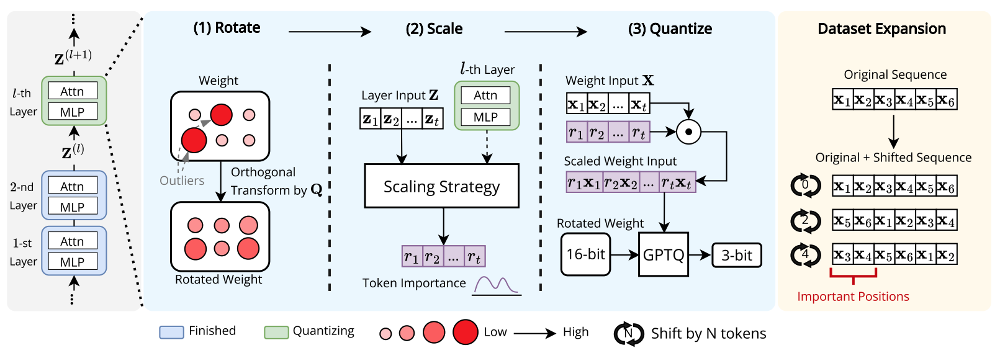

# RSQ
This repository contains the code for [**RSQ**: Learning from Important Tokens Leads to Better Quantized LLMs]().

* Authors: [Yi-Lin Sung](https://ylsung.github.io/), [Prateek Yadav](https://prateeky2806.github.io/), [Jialu Li](https://jialuli-luka.github.io/), [Jaehong Yoon](https://jaehong31.github.io/), [Mohit Bansal](https://www.cs.unc.edu/~mbansal/)


## Abstract
Previous Layer-wise quantization methods typically quantize the weights of each layer by **uniformly** optimizing the layer reconstruction loss across all output tokens. However, in this paper, we demonstrate that better-quantized models can be obtained by prioritizing learning from **important tokens** (e.g. which have large attention scores). Building on this finding, we propose **RSQ (Rotate, Scale, then Quantize)**, which (1) applies rotations (orthogonal transformation) to the model to mitigate outliers (those with exceptionally large magnitude), (2) scales the token feature based on its importance, and (3) quantizes the model using the GPTQ framework with the second-order statistics computed by scaled tokens. We demonstrate that RSQ consistently **outperforms baseline methods** across multiple downstream tasks and three model families: LLaMA3, Mistral, and Qwen2.5. Additionally, models quantized with RSQ achieve superior performance on **long-context tasks**.



## Installation
Install the QuaRot kernel, QuIP\# kernel, and other requirements.

```bash
conda create -n "rsq" python=3.11.5
pip install -r requirements.txt
pip install -e .
```

If you see the following errors when you import "fast_hadamard_transformation"
```g
ImportError: .../libstdc++.so.6: version `GLIBCXX_3.4.32' not found (required by .../rsq/third-party/fast-had
amard-transform/fast_hadamard_transform_cuda.cpython-311-x86_64-linux-gnu.so)
```

You can use the following script to check if GLIBCXX_3.4.32 is not in your environment
```
find $CONDA_PREFIX -name "libstdc++.so.6" -exec strings {} \; | grep GLIBCXX
```

You can solve the issue by installing the latest GLIBCXX
```
conda install -c conda-forge libstdcxx-ng
```
Or see [this](https://stackoverflow.com/questions/76974555/glibcxx-3-4-32-not-found-error-at-runtime-gcc-13-2-0) for other solutions.

## Environment Variables
Set the environment variables (`CODEPATH`, `CHECKPOINT_PATH`) in [`scripts/env.sh`](scripts/env.sh). `CODEPATH` should be set as the directory of this repo. For example, set it to `XXX/rsq` if this repo's directory is XXX/rsq. Be sure to manually create the `CHECKPOINT_PATH` before using the scripts.

## Dataset

### Short-context Tasks
The script will automatically download the dataset using `lm-eval`

### Long-context Tasks
Follow the original readme to download the dataset if necessary.

* For LongEval and LostInTheMiddle: [here](qllm-eval/qllm_eval/evaluation/q_long/README.md)
* For LongICLBench: [here](LongICLBench/README.md)
* For LEval: [here](LEval/README.md)
* For LongCodeArena: [here](lca-baselines/README.md)


## Execution

Run experiment sequentially on one GPU
```bash
bash scripts/job_sequential.sh [gpu_id] [script]
```

Run experiment in parallel over GPUs 
```bash
bash scripts/job_allocater.sh -t [num_activated_gpus] -a [activated_gpu] [script]
```

Explanation and example to run the scripts
```bash
[gpu_id] = 0 # use the 0th GPU
[gpu_id] = 2 # use the 2nd GPU

[num_activated_gpus] = 3 # the script will see GPU_ID from 0 - 2
[num_activated_gpus] = 8 # the script will see GPU_ID from 0 - 7

[activated_gpu] = "0,1" # use the 0th and 1st GPU
[activated_gpu] = "2,7" # use the 2nd and 7th GPU

[script] = scripts/run_16bit.sh # run 16-bit model
[script] = scripts/run_gptq.sh # run GPTQ baseline
[script] = scripts/run_quarot.sh # run GPTQ baseline
[script] = scripts/run_rsq.sh # run RSQ without dataset expansion (faster and more memory efficient)
[script] = scripts/run_rsq_expand.sh # run RSQ with dataset expansion (offload activations to cpu because of the expansion)
[script] = scripts/run_rsq_heuristic.sh # run RSQ with heuristic approaches
[script] = scripts/run_rsq_e8p.sh # run RSQ with e8p vector grid
[script] = scripts/run_eval.sh # run short-context tasks evaluation
[script] = scripts/run_long_eval.sh # run long-context tasks evaluation
```

**[Note]**
* You can change the model from LLaMAg to Mistral or Qwen inside the scripts.
* You can change the scaling strategy in [`run_rsq.sh`](scripts/run_rsq.sh) and [`run_rsq_expand.sh`](scripts/run_rsq_expand.sh).
* Update the actual checkpoint path in [`run_eval.sh`](scripts/run_eval.sh) and [`run_long_eval.sh`](scripts/run_long_eval.sh) while using them.

## Citation 

Please cite our work if you found this repo helpful.

```bibtex
@article{Sung2025RSQ,
  title={{RSQ}: Learning from Important Tokens Leads to Better Quantized LLMs},
  author={Yi-Lin Sung and and Prateek Yadav and Jialu Li and Jaehong Yoon and Mohit Bansal},
  journal={ArXiv},
  year={2025},
  volume={},
}
```
